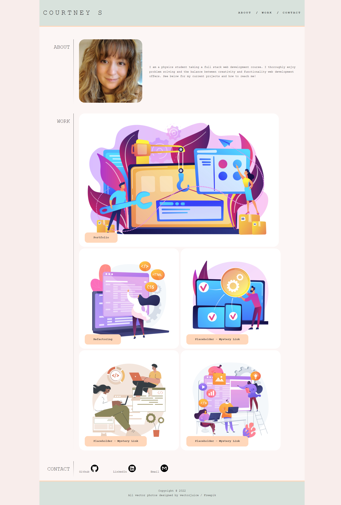

# Portfolio

I made this to be a portfolio to house all my current and ongoing web development work.

## Purpose

The purpose of this project was not only to create a space to house links to my project but also to practice using HTML and CSS by building a webpage from scratch.

## Goal

The goal of this project was to create a functional webpage from scratch that would house project links. It needed to function properly while also being accessible and responsive. It also needed to adapt to a range of screen sizes.

## Deployment

See below for a screenshot and a link to the deployed web page.

https://struelensc.github.io/portfolio/

